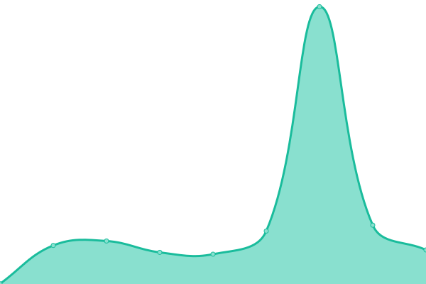
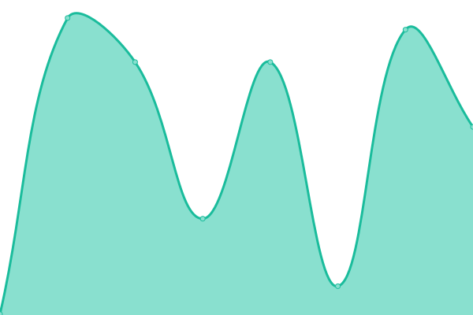
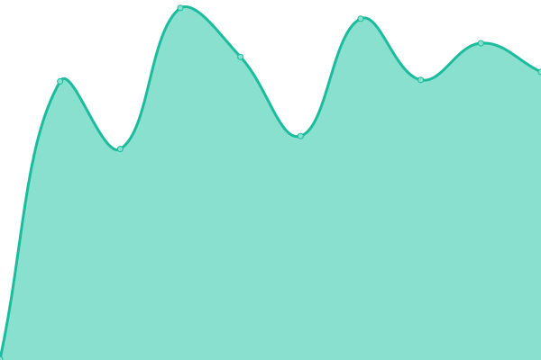

# [📈 Live Status](https://status.eventnexo.co): <!--live status--> **🟧 Partial outage**

This repository contains the open-source uptime monitor and status page for [Upptime](https://upptime.js.org), powered by [Upptime](https://github.com/upptime/upptime).

With [Upptime](https://upptime.js.org), you can get your own unlimited and free uptime monitor and status page, powered entirely by a GitHub repository. We use [Issues](https://github.com/upptime/upptime/issues) as incident reports, [Actions](https://github.com/mrsz-innovate/status/actions) as uptime monitors, and [Pages](https://status.eventnexo.co) for the status page.

<!--start: status pages-->
<!-- This summary is generated by Upptime (https://github.com/upptime/upptime) -->
<!-- Do not edit this manually, your changes will be overwritten -->
<!-- prettier-ignore -->
| URL | Status | History | Response Time | Uptime |
| --- | ------ | ------- | ------------- | ------ |
|  [Dashboard](https://app.eventnexo.co) | 🟩 Up | [dashboard.yml](https://github.com/mrsz-innovate/status/commits/HEAD/history/dashboard.yml) | 

 311ms
     
 | 

<a href="https://status.eventnexo.co/history/dashboard">100.00%</a>
    

|  [Eventnexo Website](https://eventnexo.co) | 🟩 Up | [eventnexo-website.yml](https://github.com/mrsz-innovate/status/commits/HEAD/history/eventnexo-website.yml) | 

 292ms
     
 | 

<a href="https://status.eventnexo.co/history/eventnexo-website">100.00%</a>
    

|  [Me App](https://eventnexo.me) | 🟩 Up | [me-app.yml](https://github.com/mrsz-innovate/status/commits/HEAD/history/me-app.yml) | 

 275ms
     
 | 

<a href="https://status.eventnexo.co/history/me-app">100.00%</a>
    

|  [Backend Api](https://api.eventnexo.co/api) | 🟥 Down | [backend-api.yml](https://github.com/mrsz-innovate/status/commits/HEAD/history/backend-api.yml) | 

 0ms
     
 | 

<a href="https://status.eventnexo.co/history/backend-api">0.00%</a>
    

<!--end: status pages-->

[**Visit our status website →**](https://status.eventnexo.co)

## 📄 License

- Powered by: [Upptime](https://github.com/upptime/upptime)
- Code: [MIT](./LICENSE) © [Upptime](https://upptime.js.org)
- Data in the `./history` directory: [Open Database License](https://opendatacommons.org/licenses/odbl/1-0/)
